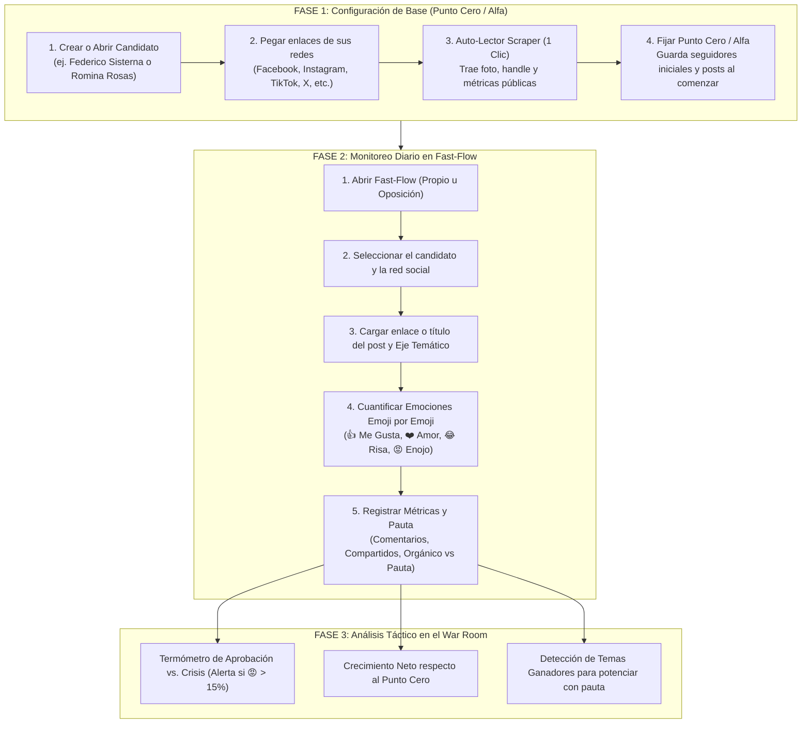

# 📋 PLAN DE FLUJO OPERATIVO & REESTRUCTURACIÓN DEL NAVBAR
## BrandingPo — War Room & Intelligence Suite

Este documento contiene la guía paso a paso y la arquitectura de flujo para implementar la **separación por bloques de acción en el Navbar** y el **workflow unificado y simétrico** tanto para **Mi Candidato** como para los **Contrincantes / Oposición (ej. Romina Rosas, Carlos Morales, etc.)**.

---

## 🧭 1. Nueva Arquitectura del Navbar / Sidebar (Agrupado por Bloques de Acción)

En lugar de una lista plana, el menú lateral se organiza en **4 bloques operativos claros con encabezados y colores temáticos**:

```text
┌───────────────────────────────────────────────────────────────┐
│ 🎖️ MI CAMPAÑA (OFICIAL / PROPIA)                              │
│ ├─ 👤 Mi Candidato & Redes    (/mi-candidato)                │
│ │   └─ Datos, foto, semáforo de redes y Punto Cero inicial.   │
│ ├─ ⚡ Fast-Flow Propio         (/fast-flow?tipo=propio)       │
│ │   └─ Carga de posts propios: emojis, alcance, pauta real.   │
│ └─ 📱 Feed Propio             (/feed?filtro=propio)          │
│     └─ Timeline cronológico de publicaciones del candidato.   │
├───────────────────────────────────────────────────────────────┤
│ ⚔️ INTELIGENCIA DE OPOSICIÓN (RIVALES)                       │
│ ├─ 👥 Fichas de Rivales       (/candidatos)                  │
│ │   └─ Crear rival (ej. Romina Rosas), auto-lector y Punto 0. │
│ ├─ ⚡ Fast-Flow Oposición      (/fast-flow?tipo=oposicion)    │
│ │   └─ Auditar posts del rival: qué dijo, 👍 ❤️ 😂 😡, etc.   │
│ └─ 📊 Comparativa & Benchmarking (/candidatos/benchmarking)   │
│     └─ Quién crece más rápido y qué ejes temáticos rinden.    │
├───────────────────────────────────────────────────────────────┤
│ 🌍 TERRITORIO, MEDIOS & ENTORNO                              │
│ ├─ 📍 Territorio & Demografía (/territorios)                 │
│ │   └─ Padrón, pirámide etaria (16-29, 30-49), urbano/campo.  │
│ ├─ 📰 Observatorio de Medios  (/medios)                      │
│ │   └─ Clipping de notas: qué dice la prensa (Propio vs Rival)│
│ └─ 🚨 Centro de Crisis        (/crisis)                      │
│     └─ Monitoreo de alertas rojas (😡 > 15%) y alianzas.     │
├───────────────────────────────────────────────────────────────┤
│ 🏛️ SALA DE MANDO & ESTRATEGIA                               │
│ ├─ 📊 Sala de Situación       (/dashboard)                   │
│ │   └─ Tablero general ejecutivo (War Room).                  │
│ ├─ 🎯 Predictor de Pauta      (/predictor)                   │
│ │   └─ Simulador algorítmico de presupuesto por red social.   │
│ └─ 📅 Calendario & Agenda     (/calendario)                  │
│     └─ Actos de campaña, recorridas y pautas programadas.     │
└───────────────────────────────────────────────────────────────┘
```

---

## 🔄 2. El Flujo Operativo Simétrico: Candidato Propio vs. Rivales

El flujo de trabajo es exactamente el mismo para **nuestro candidato** y para **cada uno de los rivales**:



---

## 🛠️ 3. Tareas Técnicas a Ejecutar en Casa

### A. Modificación de `WarRoomLayout.vue` (Navbar / Sidebar)
1. Estructurar el array `navigation` con categorías/secciones:
   - `seccion: 'Mi Campaña (Oficial)'`
   - `seccion: 'Inteligencia de Oposición'`
   - `seccion: 'Territorio & Entorno'`
   - `seccion: 'Sala de Mando'`
2. Renderizar encabezados sutiles en mayúsculas (`text-[10px] font-mono font-bold text-slate-400 tracking-wider`) entre cada bloque.

### B. Ajustes en `FastFlow.vue` y `PublicacionController.php`
1. Permitir que el selector de candidato en Fast-Flow venga pre-filtrado si la URL es:
   - `/fast-flow?tipo=propio` &rarr; Selecciona por defecto a Federico Sisterna (Candidato Propio).
   - `/fast-flow?tipo=oposicion` &rarr; Abre el listado exclusivo de rivales (Romina Rosas, Carlos Morales, etc.).
2. Agregar un switch rápido en la cabecera de Fast-Flow:
   - `[ 🎖️ Cargar Post Propio ]` | `[ ⚔️ Auditar Post de Rival ]`

### C. Fichas de Rivales (`Candidatos/Show.vue`)
1. Asegurar que la ficha de cada rival cuente con:
   - Botonera centrada de 6 columnas con logos oficiales SVG.
   - Lector Scraper con 1 clic (`SocialProfileScraperService`).
   - Tabla adaptativa de 3 columnas para Facebook (ocultando posts iniciales).
   - Tabla de Punto Cero con cálculo de crecimiento neto en tiempo real.

---

## 🚀 4. Comandos Útiles para Levantar el Proyecto en Casa

```bash
# 1. Traer los últimos cambios de GitHub
git pull origin main

# 2. Levantar el servidor PHP y Vite
php artisan serve
npm run dev

# 3. Acceder al War Room
http://localhost:8000  # o http://brandingpo.test
```

---
*Documento guardado y versionado en el repositorio.* 🎯
