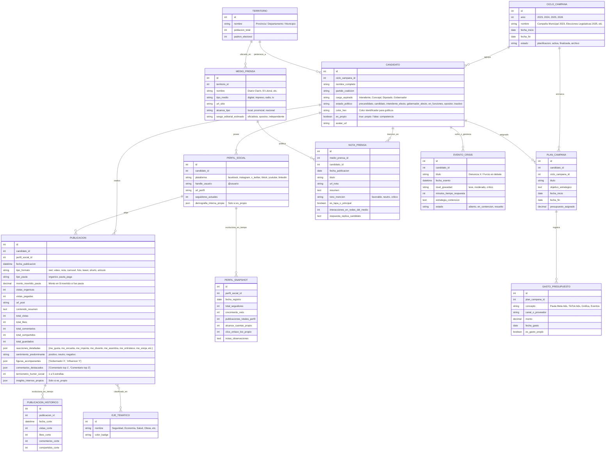

# 🏛️ PLAN MAESTRO - BRANDINGPO
### *Plataforma Monolítica de Inteligencia Política, Monitoreo de Medios & Benchmarking Digital Multired*

---

## 📌 1. Visión General del Producto

**BrandingPo** es una suite integral de inteligencia, estrategia y consultoría política digital diseñada para:
1. **Auditar y comparar** el posicionamiento, ritmo de publicación, engagement e impacto de un candidato frente a sus competidores en **múltiples redes sociales (Facebook, Instagram, X/Twitter, TikTok, YouTube, LinkedIn)**.
2. **Cuantificar y mapear el ecosistema de medios de prensa** (portales digitales, diarios, radios y TV local), analizando líneas editoriales, notas a favor/en contra, apoyos y réplicas.
3. **Motor de Inteligencia Temporal y Correlación Causa-Efecto:** Conectar publicaciones, notas de prensa y eventos con picos de crecimiento de seguidores, saltos de engagement y alertas de crisis.
4. **Simulador y Predictor de Impacto de Pauta (Ads Impact & ROI Predictor):** Estimar el alcance y visualizaciones potenciales al inyectar presupuesto a un post orgánico o nuevo formato, basado en el historial de pauta previa del mismo formato/plataforma/eje. Muestra una curva de rendimiento dinámico con **Porcentaje de Proximidad / Certeza** que se afina a medida que se acumula más historial.
5. **Estructura por Años/Ciclos de Campaña y Estados Políticos:** Organización temporal por años de campaña (ej. Campaña 2023, Elecciones 2025, Gestión 2026) y etiquetado dinámico del estado del actor político (*Precandidato*, *Candidato Oficial*, *Intendente/Gobernador Electo*, *Mandatario en Funciones*, etc.).
6. **Módulos Estratégicos Avanzados:** Ejes discursivos/temáticos, clima de comentarios, alianzas/padrinos políticos, radar de pauta (Ads Spy), índice de penetración electoral y reportes ejecutivos en 1 clic.
7. **Ergonomía de Carga "Fast-Flow":** Interfaz ultra-rápida con atajos de teclado y formularios adaptativos para carga manual eficiente.

---

## 💎 2. Módulos Estratégicos de Alto Valor

```
┌─────────────────────────────────────────────────────────────────────────────────────────────┐
│                            SUITE DE INTELIGENCIA POLÍTICA INTEGRADA                         │
├──────────────────────────────────────────┬──────────────────────────────────────────────────┤
│ 🏷️ EJES DISCURSIVOS & NARRATIVA          │ 💬 CLIMA SOCIAL & COMENTARIOS DESTACADOS         │
│ • Clasificación temática (Seguridad,     │ • Registro de los 2-3 comentarios más votados    │
│   Economía, Obras, Denuncias, Familia).  │ • Termómetro de humor social (1 a 5 estrellas).  │
│ • Share of Voice temático vs. rivales.   │ • Detección de argumentos para contra-discursos. │
├──────────────────────────────────────────┼──────────────────────────────────────────────────┤
│ 🎯 SIMULADOR & PREDICTOR DE PAUTA        │ 🚨 SEMÁFORO DE CRISIS & RESPUESTA                │
│ • Predicción de visualizaciones por $    │ • Registro de eventos críticos / ataques.        │
│ • Histórico comparativo por formato.     │ • Medición de tiempo de reacción del equipo.     │
│ • % de Proximidad / Calibración continua.│ • Monitoreo de contención de daños.              │
├──────────────────────────────────────────┼──────────────────────────────────────────────────┤
│ 🤝 ALIANZAS & PADRINOS POLÍTICOS         │ 🗳️ ÍNDICE DE PENETRACIÓN ELECTORAL              │
│ • Registro de figuras en foto/video      │ • Cruce con padrón electoral del departamento.   │
│   (Gobernador, Intendente, Influencer).  │ • Índice de Afinidad Digital por municipio.      │
│ • Impacto: ¿La alianza suma o resta?     │ • Segmentación por Ciclo de Campaña / Año.       │
├──────────────────────────────────────────┼──────────────────────────────────────────────────┤
│ 🕵️ RADAR DE PAUTA (ADS SPY)              │ 🏷️ ESTADOS DEL CANDIDATO & CICLOS DE CAMPAÑA     │
│ • Monitoreo de Meta Ads / TikTok Ads.    │ • Precandidato, Candidato, Intendente Electo...  │
│ • Temáticas y audiencias pagadas rivales.│ • Segmentación histórica año por año.            │
├──────────────────────────────────────────┼──────────────────────────────────────────────────┤
│ 📄 BRIEFING EJECUTIVO EN 1 CLIC          │ ⌨️ MODO CARGA "FAST-FLOW" ERGONÓMICO             │
│ • Reporte semanal para WhatsApp/PDF.     │ • Atajos de teclado completos (Ctrl+Enter, etc). │
│ • Ficha de situación para el candidato.  │ • Pegado inteligente de enlaces y hashtags.      │
└──────────────────────────────────────────┴──────────────────────────────────────────────────┘
```

---

## ⚖️ 3. Asimetría de Métricas: Perfil Propio vs. Competencia

```
┌──────────────────────────────────────────┬──────────────────────────────────────────────────┐
│ 👁️ CAPA PÚBLICA (Competencia y Propio)    │ 🔐 CAPA INTERNA / AVANZADA (Solo Perfil Propio)  │
├──────────────────────────────────────────┼──────────────────────────────────────────────────┤
│ • Seguidores / Suscriptores públicos     │ • Cuentas alcanzadas reales (Reach único)        │
│ • Reacciones detalladas (👍, ❤️, 😂, 😡)  │ • Impresiones totales y desglose por origen      │
│ • Comentarios y Compartidos/Reposts      │ • Clics en enlace de biografía / WhatsApp web    │
│ • Reproducciones / Vistas públicas       │ • Demografía real (% Edad, Género, Localidades)  │
│ • Pauta detectada (Biblioteca de Ads)    │ • Retención de video y tasa de finalización      │
│ • Formato y ritmo de publicación         │ • Inversión real exacta en Pauta (CPC, CPM)      │
│                                          │ • Calibración del Predictor de Impacto ($)       │
└──────────────────────────────────────────┴──────────────────────────────────────────────────┘
```

---

## 🌐 4. Matriz de Redes Sociales & Métricas Específicas

| Red Social | Reacciones / Métricas Específicas | Formatos de Contenido |
| :--- | :--- | :--- |
| **📘 Facebook** | 👍 ❤️ 🥰 😂 😮 😢 😡 \| Comentarios, Compartidos, Vistas Video, Clics enlace | Post Foto, Nota/Link, Video, Reel, Live |
| **📸 Instagram** | Likes, Comentarios, Compartidos, Guardados (Saves), Reproducciones Reels | Reel, Carrusel, Foto simple, Historia/Story |
| **🐦 X (Twitter)** | Vistas/Impresiones públicas (Views), Reposts, Citas, Likes, Respuestas, Guardados | Tweet, Hilo/Thread, Video, Encuesta, Space |
| **🎵 TikTok** | Reproducciones (Views), Likes, Comentarios, Compartidos, Guardados/Favoritos | Video corto, Video largo, Carrusel fotos |
| **🔴 YouTube** | Visualizaciones, Likes, Comentarios, Suscriptores estimados | Video largo, Shorts, Directo, Post Comunidad |
| **💼 LinkedIn** | 👍 👏 🤝 ❤️ 💡 🎯 \| Comentarios, Veces compartido, Impresiones | Artículo, Documento PDF/Carrusel, Video |

---

## 🗄️ 5. Modelo de Datos y Entidades Principales



---

## 🎯 6. Motor Predictor & Simulador de Pauta (Ads Impact Predictor)

### 📈 Lógica de Funcionamiento:
1. **Recolección y Agrupación Histórica:**
   - Agrupa los posts previos con pauta paga por: `[Plataforma + Formato + Eje Temático + Ciclo/Año]`.
   - Calcula métricas clave reales: **CPV (Costo por Visualización)**, **CPM (Costo por Mil Impresiones)** y **Tasa de Conversión/Engagement**.
2. **Simulación Dinámica:**
   - El usuario selecciona un post orgánico (o define un nuevo borrador de formato/eje) e ingresa un monto a simular (ej. $10.000, $50.000, $200.000).
   - El motor estima la curva de rendimiento esperado (Vistas estimadas mínimas, promedio y máximas).
3. **Índice de Proximidad / Fiabilidad (% de Certeza):**
   - Basado en el volumen de muestras históricas previas y dispersión de desviación estándar:
     - *< 3 muestras:* Proximidad ~45% (Aviso: "Modelo inicial con datos de referencia generales").
     - *4 a 10 muestras:* Proximidad ~70-80% ("Modelo calibrado con historial moderado").
     - *> 10 muestras:* Proximidad > 90% ("Modelo de alta precisión altamente afinado").
4. **Comparador de Eficiencia de Formato:**
   - Asesora al estratega: "¿Qué formato rinde más por cada peso invertido? (ej. Reel vs. Carrusel vs. Video Largo)".

---

## 💻 7. Módulos del Sistema

1. **⚡ Fast-Flow Entry Desk:** Formulario adaptativo por red social, teclado numérico rápido, autoguardado, registro de pauta y modo tabla batch.
2. **📱 Feed Multired Interactivo (Social Wall):** Muro estilo red social moderno con posts de candidatos, tarjetas multimedia, barra de reacciones con emojis nativos (👍 ❤️ 😂 😮 😡), comentarios destacados, badge de pauta y réplicas.
3. **🎯 Simulador & Predictor de Pauta:** Calculadora interactiva de impacto de inversión sobre posts orgánicos con score de proximidad y recomendación de formato ganador.
4. **📊 War Room & Head-to-Head Analytics:** Comparativas de crecimiento temporal, distribución de emociones, formatos ganadores, segmentado por **Ciclo de Campaña / Año** y **Estado Político** del actor.
5. **🏷️ Narrativa & Ejes Discursivos:** Análisis de qué temas traccionan más y de qué habla la competencia.
6. **📰 Observatorio de Medios & Clipping:** Directorio cuantificado de portales, sesgo editorial, portadas y réplicas.
7. **🚨 Centro de Crisis & Alianzas:** Monitoreo de eventos críticos, tiempos de respuesta y análisis de figuras que suman o restan.
8. **📅 Calendario, Presupuesto & Pauta (Ads Spy):** Cronograma editorial, control financiero y radar de anuncios rivales.
9. **📄 Generador de Briefings Ejecutivos:** Exportación en 1 clic de fichas de situación semanales/diarias.

---

## 🛠️ 8. Arquitectura Técnica & UI/UX

- **Backend:** Laravel 11 (PHP 8.2+).
- **Frontend / SPA:** Inertia.js + Vue 3 (Composition API / `<script setup>`).
- **Base de Datos:** SQLite (diseño relacional + columnas JSON para escalabilidad).
- **Sistema de Temas:** **Modo Oscuro (Dark Slate)** & **Modo Claro (Executive Light)** con selector interactivo persistente (Sol/Luna).
- **Estética Visual:** Fusión de **War Room Estratégico** + **Social Feed Dinámico** con Tailwind CSS.
- **Visualización:** Chart.js / ApexCharts + Lucide Icons.

---

## 🗺️ 9. Plan de Sprints Representativos (Metodología de Entrega)

Cada Sprint es un ciclo atómico que incluye: **Desarrollo de Funcionalidad + Seeders Realistas + Pruebas & Validación por Roles + Git Commit & Push**.

```
┌─────────────────────────────────────────────────────────────────────────────────────────────┐
│                              CICLO DE EJECUCIÓN POR SPRINT                                  │
├─────────────────────────────────────────────────────────────────────────────────────────────┤
│ 1. Backend & Frontend ➡️ 2. Seeders Realistas ➡️ 3. Testing & Permisos ➡️ 4. Commit & Push │
└─────────────────────────────────────────────────────────────────────────────────────────────┘
```

---

### 🚀 **Sprint 1: Setup Base & Scaffolding War Room**
- **Alcance:**
  - Inicialización del proyecto Laravel 11 + Inertia.js + Vue 3 (`<script setup>`) + Tailwind CSS + Lucide Icons + SQLite.
  - Layout Base "War Room" (Dark Slate, navegación lateral colapsable, selector de ciclo de campaña, cabecera de alertas).
- **Seeders:** Configuración inicial del sistema y parámetros base.
- **Validación:** Renderizado correcto de layout responsivo en tema oscuro/claro.
- **Cierre:** `git commit -m "feat(sprint-1): setup base de proyecto y scaffolding war room"` & `git push`.

---

### 👥 **Sprint 2: Autenticación, Roles & Matriz de Permisos**
- **Alcance:**
  - Sistema de usuarios con 3 roles estrictos:
    1. `Admin` (Supervisión, gestión de usuarios y configuración).
    2. `Consultor` (Rol operativo: carga fast-flow, edición, pauta, análisis).
    3. `Visualizador` (Solo lectura: dashboards, reportes, sin botones de acción ni mutaciones).
  - Middleware y Policies de autorización en backend y directivas de UI en Vue.
- **Seeders Representativos:**
  - `admin@brandingpo.com` (Rol: Admin).
  - `consultor@brandingpo.com` (Rol: Consultor).
  - `visualizador@brandingpo.com` (Rol: Visualizador).
- **Validación:** Verificar que el usuario `Visualizador` no pueda acceder a rutas de mutación ni ver botones de crear/editar/eliminar.
- **Cierre:** `git commit -m "feat(sprint-2): autenticacion, roles admin-consultor-visualizador y seeders"` & `git push`.

---

### 🏛️ **Sprint 3: Territorios, Ciclos de Campaña y Perfiles Políticos**
- **Alcance:**
  - Módulos de `CicloCampana` (Años / Períodos), `Territorio` (Municipios / Departamentos con padrón electoral) y `Candidato` con su `estado_politico` (`precandidato`, `candidato`, `intendente_electo`, `gobernador_electo`, `en_funciones`, `opositor`).
  - Módulo de `PerfilSocial` multired (Facebook, Instagram, X, TikTok, YouTube, LinkedIn) y `EjeTematico`.
  - Vistas de gestión de candidatos y catálogo de perfiles.
- **Seeders Representativos:**
  - **1 Perfil Propio:** *Intendente en Gestión / Candidato a Reelección*.
  - **2 Candidatos Opositores:** *Rival Principal* y *Precandidato Emergente*.
  - **1 Candidato / Intendente Electo:** *Caso de transición institucional*.
  - 1 Territorio con padrón electoral y 2 Ciclos de Campaña (ej. Campaña 2023 y Elecciones 2025).
- **Validación:** Filtro de candidatos por ciclo y estado político; comprobación de relaciones y badges en UI.
- **Cierre:** `git commit -m "feat(sprint-3): territorios, ciclos de campana y perfiles politicos representativos"` & `git push`.

---

### ⚡ **Sprint 4: Motor Fast-Flow Multired & Carga de Publicaciones con Pauta**
- **Alcance:**
  - Formulario adaptativo *Fast-Flow Entry Desk* con selector de red, atajos de teclado y guardado ágil.
  - Registro de reacciones detalladas según red social, desglose de pauta (monto invertido en $, vistas orgánicas vs. vistas pagadas), comentarios destacados y termómetro de humor social.
  - Modo batch de carga rápida.
- **Seeders Representativos:**
  - 30+ publicaciones realistas distribuidas entre los 4 candidatos y las 6 redes sociales.
  - Publicaciones con pauta y sin pauta para alimentar el historial de costos por formato.
- **Validación:** Carga fluida con teclado, validación de Form Requests y cálculo automático de interacciones totales.
- **Cierre:** `git commit -m "feat(sprint-4): motor fast-flow multired y registro de publicaciones con pauta"` & `git push`.

---

### 📰 **Sprint 5: Observatorio de Medios, Clipping & Centro de Crisis**
- **Alcance:**
  - Módulo de `MedioPrensa` (diarios digitales, radio, tv, impresos con sesgo editorial) y `NotaPrensa` (titular, tono favorable/neutro/crítico, impacto en redes, réplica oficial).
  - Semáforo de `EventoCrisis` (gravedad, tiempo de respuesta, estrategia de contención) y registro de `Alianzas / Padrinos Políticos`.
- **Seeders Representativos:**
  - 8 medios de prensa con líneas editoriales diversas.
  - 15 notas de prensa categorizadas por candidato y tono.
  - 2 casos de crisis con métricas de tiempo de contención.
- **Validación:** Visualización del mapa de cobertura de medios y semáforo de crisis reactivo.
- **Cierre:** `git commit -m "feat(sprint-5): observatorio de medios, clipping y centro de crisis"` & `git push`.

---

### 📊 **Sprint 6: War Room Analytics & Simulador Predictor de Pauta**
- **Alcance:**
  - Dashboard analítico Head-to-Head: curvas de crecimiento temporal, matriz de sentimientos, formatos con mayor engagement.
  - **Simulador & Predictor de Pauta:**
    - Algoritmo de cálculo de CPV/CPM histórico según `[Plataforma + Formato + Eje]`.
    - Calculadora interactiva con slider de presupuesto en $.
    - Indicador visual de **Porcentaje de Proximidad / Certeza** del modelo.
    - Comparador de formatos más eficientes por inversión.
  - Segmentación global por Ciclo de Campaña y Estado Político.
- **Seeders de Calibración:** Validación con datos históricos para calibrar la fórmula de proximidad.
- **Validación:** Comprobación matemática del simulador y dinamismo de los gráficos Chart.js / ApexCharts.
- **Cierre:** `git commit -m "feat(sprint-6): war room analytics y simulador predictor de pauta con proximidad"` & `git push`.

---

### 📅 **Sprint 7: Calendario, Presupuesto, Briefings Ejecutivos & Cierre**
- **Alcance:**
  - Calendario editorial y control de presupuesto de campaña con radar Ads Spy.
  - **Generador de Briefings Ejecutivos en 1 Clic:** Vista ejecutiva optimizada para exportación / WhatsApp / PDF print con resumen semanal de situación.
  - Auditoría general de seguridad y prueba de experiencia completa para los 3 roles (`Admin`, `Consultor`, `Visualizador`).
- **Seeders:** Conjunto integral de datos de demostración listo para producción.
- **Validación:** Test end-to-end de todos los flujos del sistema.
- **Cierre:** `git commit -m "feat(sprint-7): calendario, briefings ejecutivos y suite completa finalizada"` & `git push`.
