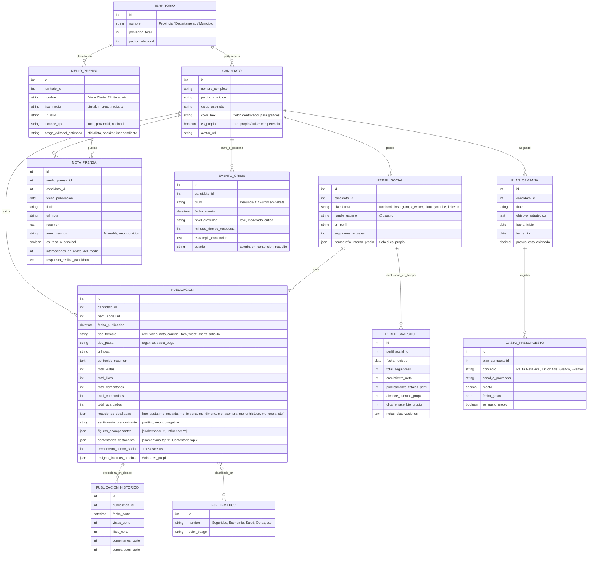

# 🏛️ PLAN MAESTRO - BRANDINGPO
### *Plataforma Monolítica de Inteligencia Política, Monitoreo de Medios & Benchmarking Digital Multired*

---

## 📌 1. Visión General del Producto

**BrandingPo** es una suite integral de inteligencia, estrategia y consultoría política digital diseñada para:
1. **Auditar y comparar** el posicionamiento, ritmo de publicación, engagement e impacto de un candidato frente a sus competidores en **múltiples redes sociales (Facebook, Instagram, X/Twitter, TikTok, YouTube, LinkedIn)**.
2. **Cuantificar y mapear el ecosistema de medios de prensa** (portales digitales, diarios, radios y TV local), analizando líneas editoriales, notas a favor/en contra, apoyos y réplicas.
3. **Motor de Inteligencia Temporal y Correlación Causa-Efecto:** Conectar publicaciones, notas de prensa y eventos con picos de crecimiento de seguidores, saltos de engagement y alertas de crisis.
4. **Módulos Estratégicos Avanzados:** Ejes discursivos/temáticos, clima de comentarios, alianzas/padrinos políticos, radar de pauta (Ads Spy), índice de penetración electoral y reportes ejecutivos en 1 clic.
5. **Ergonomía de Carga "Fast-Flow":** Interfaz ultra-rápida con atajos de teclado y formularios adaptativos para carga manual eficiente.

---

## 💎 2. Módulos Estratégicos de Alto Valor

```
┌─────────────────────────────────────────────────────────────────────────────────────────────┐
│                            SUITE DE INTELIGENCIA POLÍTICA INTEGRADA                         │
├──────────────────────────────────────────┬──────────────────────────────────────────────────┤
│ 🏷️ EJES DISCURSIVOS & NARRATIVA          │ 💬 CLIMA SOCIAL & COMENTARIOS DESTACADOS         │
│ • Clasificación temática (Seguridad,     │ • Registro de los 2-3 comentarios más votados    │
│   Economía, Obras, Denuncias, Familia).  │ • Termómetro de humor social (1 a 5 estrellas).  │
│ • Share of Voice temático vs. rivales.   │ • Detección de argumentos para contra-discursos. │
├──────────────────────────────────────────┼──────────────────────────────────────────────────┤
│ 🤝 ALIANZAS & PADRINOS POLÍTICOS         │ 🚨 SEMÁFORO DE CRISIS & RESPUESTA                │
│ • Registro de figuras en foto/video      │ • Registro de eventos críticos / ataques.        │
│   (Gobernador, Intendente, Influencer).  │ • Medición de tiempo de reacción del equipo.     │
│ • Impacto: ¿La alianza suma o resta?     │ • Monitoreo de contención de daños.              │
├──────────────────────────────────────────┼──────────────────────────────────────────────────┤
│ 🕵️ RADAR DE PAUTA (ADS SPY)              │ 🗳️ ÍNDICE DE PENETRACIÓN ELECTORAL              │
│ • Monitoreo de Meta Ads / TikTok Ads.    │ • Cruce con padrón electoral del departamento.   │
│ • Temáticas y audiencias pagadas rivales.│ • Índice de Afinidad Digital por municipio.      │
├──────────────────────────────────────────┼──────────────────────────────────────────────────┤
│ 📄 BRIEFING EJECUTIVO EN 1 CLIC          │ ⌨️ MODO CARGA "FAST-FLOW" ERGONÓMICO             │
│ • Reporte semanal para WhatsApp/PDF.     │ • Atajos de teclado completos (Ctrl+Enter, etc). │
│ • Ficha de situación para el candidato.  │ • Pegado inteligente de enlaces y hashtags.      │
└──────────────────────────────────────────┴──────────────────────────────────────────────────┘
```

---

## ⚖️ 3. Asimetría de Métricas: Perfil Propio vs. Competencia

```
┌──────────────────────────────────────────┬──────────────────────────────────────────────────┐
│ 👁️ CAPA PÚBLICA (Competencia y Propio)    │ 🔐 CAPA INTERNA / AVANZADA (Solo Perfil Propio)  │
├──────────────────────────────────────────┼──────────────────────────────────────────────────┤
│ • Seguidores / Suscriptores públicos     │ • Cuentas alcanzadas reales (Reach único)        │
│ • Reacciones detalladas (👍, ❤️, 😂, 😡)  │ • Impresiones totales y desglose por origen      │
│ • Comentarios y Compartidos/Reposts      │ • Clics en enlace de biografía / WhatsApp web    │
│ • Reproducciones / Vistas públicas       │ • Demografía real (% Edad, Género, Localidades)  │
│ • Pauta detectada (Biblioteca de Ads)    │ • Retención de video y tasa de finalización      │
│ • Formato y ritmo de publicación         │ • Inversión real exacta en Pauta (CPC, CPM)      │
└──────────────────────────────────────────┴──────────────────────────────────────────────────┘
```

---

## 🌐 4. Matriz de Redes Sociales & Métricas Específicas

| Red Social | Reacciones / Métricas Específicas | Formatos de Contenido |
| :--- | :--- | :--- |
| **📘 Facebook** | 👍 ❤️ 🥰 😂 😮 😢 😡 \| Comentarios, Compartidos, Vistas Video, Clics enlace | Post Foto, Nota/Link, Video, Reel, Live |
| **📸 Instagram** | Likes, Comentarios, Compartidos, Guardados (Saves), Reproducciones Reels | Reel, Carrusel, Foto simple, Historia/Story |
| **🐦 X (Twitter)** | Vistas/Impresiones públicas (Views), Reposts, Citas, Likes, Respuestas, Guardados | Tweet, Hilo/Thread, Video, Encuesta, Space |
| **🎵 TikTok** | Reproducciones (Views), Likes, Comentarios, Compartidos, Guardados/Favoritos | Video corto, Video largo, Carrusel fotos |
| **🔴 YouTube** | Visualizaciones, Likes, Comentarios, Suscriptores estimados | Video largo, Shorts, Directo, Post Comunidad |
| **💼 LinkedIn** | 👍 👏 🤝 ❤️ 💡 🎯 \| Comentarios, Veces compartido, Impresiones | Artículo, Documento PDF/Carrusel, Video |

---

## 🗄️ 5. Modelo de Datos y Entidades Principales



---

## 💻 6. Módulos del Sistema

1. **⚡ Fast-Flow Entry Desk:** Formulario adaptativo por red social, teclado numérico rápido, autoguardado y modo tabla batch.
2. **📊 War Room & Head-to-Head Analytics:** Comparativas de crecimiento temporal, distribución de emociones, formatos ganadores e índice de afinidad electoral.
3. **🏷️ Narrativa & Ejes Discursivos:** Análisis de qué temas traccionan más y de qué habla la competencia.
4. **📰 Observatorio de Medios & Clipping:** Directorio cuantificado de portales, sesgo editorial, portadas y réplicas.
5. **🚨 Centro de Crisis & Alianzas:** Monitoreo de eventos críticos, tiempos de respuesta y análisis de figuras que suman o restan.
6. **📅 Calendario, Presupuesto & Pauta (Ads Spy):** Cronograma editorial, control financiero y radar de anuncios rivales.
7. **📄 Generador de Briefings Ejecutivos:** Exportación en 1 clic de fichas de situación semanales/diarias.

---

## 🛠️ 7. Arquitectura Técnica

- **Backend:** Laravel 11 (PHP 8.2+).
- **Frontend / SPA:** Inertia.js + Vue 3 (Composition API / `<script setup>`).
- **Base de Datos:** SQLite (diseño relacional + columnas JSON para escalabilidad).
- **Estilos:** Tailwind CSS (Dark/Light Slate, UI tipo War Room moderna).
- **Visualización:** Chart.js / ApexCharts + Lucide Icons.

---

## 🗺️ 8. Roadmap de Desarrollo

| Fase | Alcance |
| :--- | :--- |
| **Fase 1: Setup & Arquitectura Base** | Instalación Laravel 11 + Inertia Vue 3 + Tailwind. Migraciones y modelos completos (Territorios, Candidatos, Redes, Medios, Ejes, Snapshots). |
| **Fase 2: Motor Fast-Flow Multired & Medios** | Formularios dinámicos adaptativos (Facebook, Instagram, X, TikTok, YouTube, LinkedIn), reacciones, clipping de diarios y comentarios destacados. |
| **Fase 3: Sala de Situación (War Room) & Inteligencia Temporal** | Dashboards interactivos: Crecimiento temporal, correlación contenido ➡️ seguidores, radar temático y observatorio de medios. |
| **Fase 4: Crisis, Calendario, Presupuesto & Reportes** | Módulo de crisis, radar de pauta, calendario, presupuesto y generador de briefings en 1 clic. |
